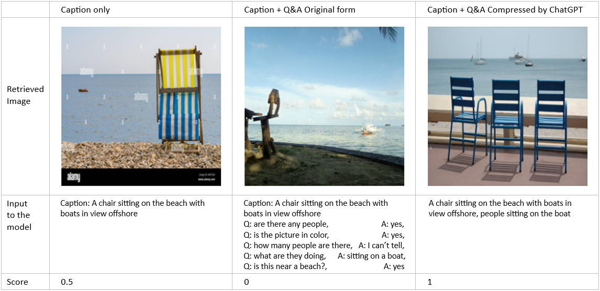

### Compressing dialogs with ChatGPT

FROMAGe is able to handle information from a conversation with multiple turns when generating a new response. The input that is given is in the form of a dialog, which can consist out of different textual inputs.

While experimenting with FROMAGe we observed that using more complex input usually leads to less accurate output. This observation suggests that the model's output could possibly be enhanced by converting the form of the dialog into a more compact and clear structure. In this experiment the approach for obtaining this more compact and clear structure is to prompt ChatGPT, such that it minimizes the text length while preserving all relevant information that the dialog contains.

The Visual Dialog dataset is chosen to perform this experiment. This dataset consists of images with 10 corresponding questions and answers pairs, and a caption. The dialogs from this dataset are suitable for this experiment, since these dialog structures simulate a Q&A about an image, and can be converted by ChatGPT into the compressed structure. This strategy is evaluated by comparing the model's capability of retrieving correct images with the original dialog as input, to the capability of retrieving correct images with the compressed dialog by ChatGPT as input. For this experiment 5 questions and answer pairs are picked for each image, combined with the caption. The following instruction is given to ChatGPT: "Transform the following caption with a question and answer dialog about an image into a caption as short as possible while capturing all the information that is given: \{dialog in original form\}". 

Three settings are being used for retrieving images: 
1. Caption Only
2. Unaugmented dialog
3. Augmented dialog by ChatGPT

An example of highest retrieved image for a text input with the corresponding score according to each of the 3 different setting is shown it the table below.

To evaluate the difference in performance, the average accuracy of 3 retrieved images was measured. The images were annotated with a '0' if the retrieved images were incorrect, '0.5' if they captured the most important information, and '1' if they captured all the information For each of the three settings 50 textual inputs were given to the model and 3 images were retrieved for each input. Those 3 images were taken into account to establish the performance for each run. The results are shown in the table below:

| Input                                      | Accuracy                  |
| ------------------------------------------ | ------------------------- |
| Caption only                               | 0.54                      |
| Unaugmented dialog                         | 0.40                      |
| Augmented dialog by ChatGPT                | 0.60                      |

These results show an improvement in the performance when the dialog is transformed into one compact sentence by ChatGPT. It even performs slightly better than the caption only, while the caption by itself contained less details (which the retrieved image had to be met) because the questions and answers were not taken into account for this setting. Hereby we can conclude that the fROMAGE model performs better when the textual input is converted into a compact manner in stead of using a sequence of unaugmented dialog messages.
