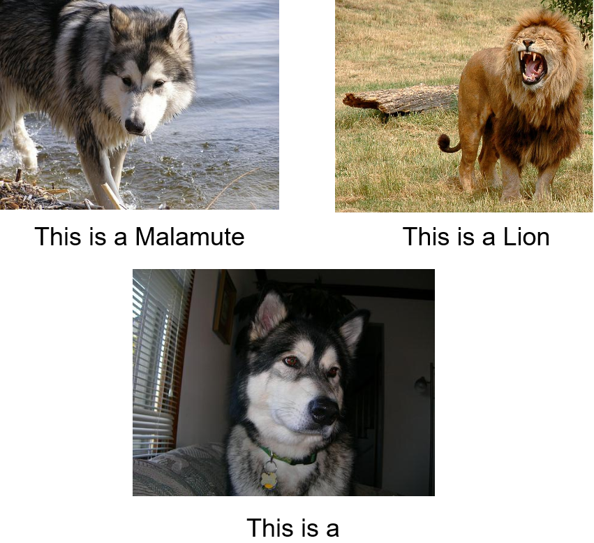

Exploring in-context learning abilities of Fromage 🧀
================================================================

28 Mar 2023 | Nikolaos Apostolikas, Panagiotis Tsakas, Vasileios Vythoulkas, Bram Slangen, Denny Smit

<!---Humans can learn a new task without requiring huge task-specific supervised datasets. -->

In recent years, the domains of computer vision and natural language processing(NLP) have witnessed the emergence of large-scale models. These models have a vast number of parameters and are pre-trained on huge datasets to acquire extensive knowledge across domains. This development has opened up new possibilities to explore the abilities of these models when few training data are available and without the need to update any of the model's parameters.
<!--- I need to add a smooth transition here -->

<!--- Maybe we can put this image later when we describe the image classification task and put here an image from the image captioning task.For  image captioning it is more clear that it needs both image and text models. 
-->
In-context learning or priming leverage additional context added to the input, which guide the model towards the required result without requiring any gradient updates. A common approach is to add input-label pairs, also known as demonstrations, together with a task instruction as a natural language prompt to an evaluation example.  
In-context learning seems very appealing because it reduces the need for task-specific data. Hence, zero-shot and few-shot learning can be used. Additionally, no parameters are updated so catastrophic forgetting cannot occur and we can use the same model for multiple tasks. Furthermore, by employing in-context learning in an interface even inexperienced users could easily use AI systems.  
Despite its intriguing properties, the models may be sensitive to the prompt that is added to the input. Therefore, exploration of prompting strategies is useful to improve the performance of large models. We will explore the in-context learning abilities of Fromage.  

Fromage model
==================================

Model Architecture
---------

First, let’s review the model architecture. Fromage combines a vision encoder and a decoder language model while keeping their parameters fixed. Specifically, it employs the CLIP model as a vision encoder and OPT as a language model to be able to handle multimodal data. To map the visual space into the text space and vice versa, learnable linear layers are utilized. Fromage has been trained on the Conceptual Caption dataset [[1]](#cc3m) containing 3.3 million image-text pairs for image-captioning and image-text retrieval. The original paper utilized this dataset for the tasks of image captioning and image-text retrieval.

<!--- I am not sure whether talking about Conceptual Caption is a 
good idea because of the image-captioning dataset. Besides, 
we need to add a picture here
-->

--------------------------

Historical Review
-----------------
There are several vision-language models desrcibed in the literature. Models such as Clip and ALIGN use vision and text encoders and calculate the similarity between the different modalities representations. <!--- Nonetheless, these models are restricted to cases where pre-defined labels are available.--> Other models like our model, Fromage, differ by combining a vision encoder with a text decoder. This allows them to generate text and be used for more open-ended tasks like image-captioning. Fromage in contrast to other models like Flamingo is also able to generate images from the Conceptual Caption Dataset on which it was trained.  
<!---Another important distinction between different vision-language models is the way they bridge different modalities. Existing approaches include finetuning cross-attention layers (Flamingo), only vision encoders (Frozen), only text  lightweight transformer blocks (Blip2), directly feeding the   -->
In-context learning became known with the remarkable success of the GPT-3 model in text tasks. Lately, in-context learning has been applied to both the vision-only models and vision-language models. Techniques to boost the performance of in-context learning include demonstration selection by image or text retrieval, making the LM generate the prompt, changing the order of the demonstrations, 

Results
-----------------

The approach followed was to first replicate the results of the paper and then explore the possibilities of in-context learning of the model, by working with different prompting strategies. Although the replication of the results was virtually impossible due to the need of manual annotators, we came up with a workaround to verify whether the results for the datasets used are accurate. Next, we tried to explore the in-context learning potential of FROMAGe, by evaluating it on several tasks (e.g. Video Captioning, Visual Question Answering, etc.). Last but not least, several prompt augmentation methods were used to explore different prompting strategies in order to determine the importance of the input for the model's output.
<!--- Not sure where we should put these paragraphs -->

&nbsp;
### Image Captioning

Although the model was trained on the CC3M dataset, it is useful to check how it performs on other datasets as well. For this purpose, we used the Flickr-8k dataset, from which we used a specific subset that according to experts, the captions are fully representative of the corresponding image. Furthermore, we augmented the input visually by adding more images. This means that given the original image that the model needed to caption, we instead asked the model to retrieve 2 similar images. After retrieving the similar images, we added them to the prompt and asked the model to perform Image Captioning for the original image. Simply put, instead of giving directly the input image, we retrieved 2 similar ones and gave all three as input, but only asked the model to caption the original one. To evaluate the model, we used the BertScore metric, which compared the model's generated caption with the target. 

BertScore leverages the pre-trained contextual embeddings from BERT and essentially what it does is that it computes the cosine similarity for each token in the text output of the model with each token in the original caption. The results obtained for this experiment can be seen in the following table.

|      Dataset      	| Average F1 score 	| Average Precision 	| Average Recall 	|
|:-----------------:	|:----------------:	|:-----------------:	|:--------------:	|
| Flickr-8k cropped 	|      0.9749      	|       0.9752      	|     0.9746     	|

&nbsp;

### Image Retrieval from Text 

In this task, we used the Flickr-8k dataset, by giving the model the caption as input and asking it to retrieve a similar image from the CC3M dataset. Moreover, for this experiment, we augmented the text input by expanding the caption. This was done by prompting the GPT-3 model asking it to provide more information about each caption. Our goal was to check whether the augmented text input will make the model retrieve a better image than the one retrieved by the original caption. The following figure explains the aforementioned procedure.

As an evaluation metric, cosine-similarity was used to compare the visual embeddings of the retrieved image using the original caption and the target image. The same was applied for the retrieved image using the augmented caption. The final step was to compare whether the cosine similarity was higher with the augmented caption or not. The visual embeddings were obtained by using the CLIP component of the FROMAGe model. The cosine-similarity displayed below is the average for all the samples seen by the model.

|  Caption  	| Cosine Similarity 	|
|:---------:	|:-----------------:	|
|  Original 	|                   	|
| Augmented 	|                   	|

&nbsp;

### Image classification

|Model |Accuracy|
|-----|--------|
|Frozen|33.7      |
|Fromage  |35.56      |

We also evaluated our model on the mini-Imagenet dataset. Specifically, we worked on the few-shot setting where we add to the input two demonstrations -one with the correct label and another with a different label. As shown in the table above, the model's performance in this setting was poor, similar to what reported in the Frozen paper. We observed that the model suffers from recency bias (cite), meaning it almost always predict the label of the demonstration that is closest in proximity to the test input.

### Guided VQA - To be added after discussion with the TA 

&nbsp;

### Insights

1.  
    
    
2.  
    

Conclusion
==========

References
==========

 [1] P. Sharma, N. Ding, S. Goodman, R. Soricut, Conceptual Captions: A Cleaned, Hypernymed, Image Alt-text Dataset For Automatic Image Captioning, in: Proceedings of the 56th Annual Meeting of the Association for Computational Linguistics (Volume 1: Long Papers), Association for Computational Linguistics, Melbourne, Australia, 2018: pp. 2556–2565. https://doi.org/10.18653/v1/P18-1238.

    