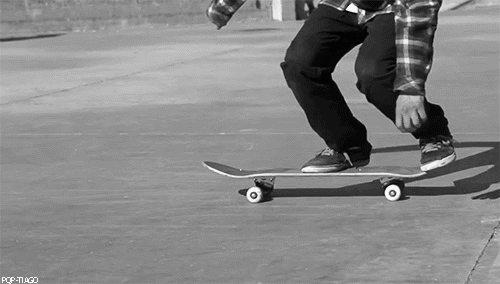
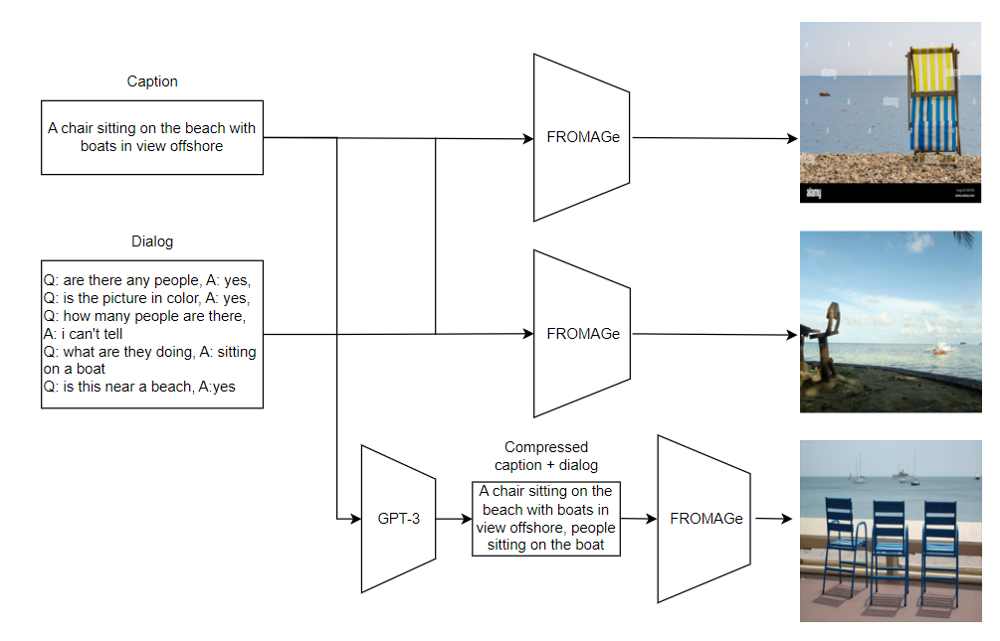

# Exploring in-context learning abilities of FROMAGe 🧀
March 2023 | Nikolaos Apostolikas, Panagiotis Tsakas, Vasileios Vythoulkas, Bram Slangen, Denny Smit

---------------
## Overview 
In this blog post, we will discuss the paper "Grounding Language Models to Images for Multimodal Generation" [[4]](#fromage). The paper proposes a method to ground pretrained text-only language models to the visual domain, enabling them to process and generate arbitrarily interleaved image-and-text data. 

The goal of this blog post is:

1. Provide an overview of the original paper.
2. Replicate the results (wherever applicable) to verify the claims of the authors.
3. Discover the in-context abilities of the model with thorough cross-domain experiments.

&nbsp;

## Introduction
<!---Humans can learn a new task without requiring huge task-specific supervised datasets. -->

In recent years, the domains of computer vision and natural language processing (NLP) have witnessed the emergence of large-scale models. These models have a vast number of parameters and are pre-trained on huge datasets to acquire extensive knowledge across domains. This development has opened up new possibilities to explore the abilities of these models when few training data are available and without the need to update any of the model's parameters.
<!--- I need to add a smooth transition here -->

<!--- Maybe we can put this image later when we describe the image classification task and put here an image from the image captioning task.For  image captioning it is more clear that it needs both image and text models. 
-->
This is where in-context learning comes up. In-context learning or priming leverages additional context added to the input, which guides the model towards the required result without requiring any gradient updates. A common approach is to add input-label pairs, also known as demonstrations, together with a task instruction as a natural language prompt to an evaluation example. One example of in-context learning is illustrated in the figure below.

  

In-context learning seems very appealing because it reduces the need for task-specific data. Hence, zero-shot and few-shot learning can be used. Additionally, no parameters are updated so catastrophic forgetting cannot occur and we can use the same model for multiple tasks. Furthermore, by employing in-context learning in an interface even inexperienced users could easily use AI systems.

Despite its intriguing properties, the models may be sensitive to the prompt that is added to the input [[8]](#prompt). Therefore, the exploration of prompting strategies is useful to improve the performance of large models. We will explore the in-context learning abilities of FROMAGe.

&nbsp;

## FROMAGe Model Architecture

First, let’s review the model architecture. FROMAGe combines a vision encoder and a decoder language model while keeping their parameters fixed. Specifically, it employs the CLIP model [[5]](#clip) as a vision encoder and OPT [[6]](#opt) as a language model to be able to handle multimodal data. To map the visual space into the text space and vice versa, learnable linear layers are utilized. FROMAGe has been trained on the Conceptual Caption dataset [[1]](#cc3m) containing 3.3 million image-text pairs for image-captioning and image-text retrieval. The original paper utilized this dataset for the tasks of image captioning and image-text retrieval.

  

<!--- I am not sure whether talking about Conceptual Caption is a 
good idea because of the image-captioning dataset. Besides, 
we need to add a picture here
-->

&nbsp;

## Related Work

There are several vision-language models described in the literature. Models such as CLIP [[5]](#clip) use vision and text encoders and calculate the similarity between the different modalities' representations. <!--- Nonetheless, these models are restricted to cases where pre-defined labels are available.--> Other models like our model, FROMAGe, differ by combining a vision encoder with a text decoder. This allows them to generate text and be used for more open-ended tasks like image-captioning. FROMAGe in contrast to other models like Flamingo is also able to retrieve images from the Conceptual Caption Dataset on which it was trained.

<!---Another important distinction between different vision-language models is the way they bridge different modalities. Existing approaches include finetuning cross-attention layers (Flamingo), only vision encoders (Frozen), only text lightweight transformer blocks (Blip2), directly feeding the   -->
<!---In-context learning became known with the remarkable success of the GPT-3 model in text tasks. Lately, in-context learning has been applied to both the vision-only models and vision-language models. A popular technique to boost the performance of in-context learning is demonstration selection by image or text retrieval. Other techniques include instruction tuning first on other datasets, making the LM generate the prompt, changing the order of the demonstrations or changing the instructions given to the model.-->

**Image augmentation:** Retrieving similar examples and adding them to the input has been a popular prompting strategy in both
the image and text domains [[9,10]](#sel1,sel2). In our visual augmentation approach, we only add input examples without their corresponding labels.
Additionally, to retrieve images, Fromage first generates a unique token and then compares the embedding similarities of this 
token with the embeddings of the images from the Conceptual Caption dataset. This characteristic of our approach has also similarities with prompt generation techniques [[11]](#gen).

**Textual augmentation:** Previous work has already explored the concept of augmenting textual input. As with other approaches, we use another language model to generate text to be added to 
the prompt. Among other tasks, text augmentation was also utilized for image captioning in our study. Instead of computing
the conditional probability P(y|x), where x represents the input image and y represents the text caption, our objective is to compute P(x|y). By adopting this perspective,
our work can also be viewed as a channel-based approach [[12]](#channel) for multi-modal data.

**Recency bias:** Language models have been shown to suffer from recency bias, often predicting the label of the demonstration that is closest in proximity
to the test input. Several methods have been proposed to mitigate the order sensitivity of the demonstrations. These methods include entropy-based techniques [[13]](#ord1),
ordering the demonstrations based on their embedding similarity with the test example [[13]](#ord1), and scaling the prediction scores based on the prediction of a content-free input [[14]](#calibrate). We experimented with the last two approaches. To the best of our knowledge, we are the first to apply the last approach in the vision domain

&nbsp;

## Experiments & Results

The approach followed was to first replicate the results of the paper and then explore the possibilities of in-context learning of the model, by working with different prompting strategies. Although the replication of the results was virtually impossible due to the need for manual annotators, we came up with a workaround to verify whether the results for the datasets used are accurate. Next, we tried to explore the in-context learning potential of FROMAGe, by evaluating it on several tasks (e.g. GIF Captioning, Visual Question Answering, etc.). Last but not least, several prompt augmentation methods were used to explore different prompting strategies to determine the importance of the input for the model's output.

For simplicity, the table below provides an overview of the experiments conducted.

|             Task            	|      Dataset        |                           Goal                          	|
|:---------------------------:	|:-----------------:	|:-------------------------------------------------------:	|
|     Visual Storytelling     	|       VIST        	|             Verify the claims of the authors            	|
|       Image Captioning      	| Cropped Flickr-8k 	| Explore the effect of visual augmentation of the prompt 	|
| Image Retrieval (from text) 	| Cropped Flickr-8k 	| Explore the effect of text augmentation of the prompt  	|
|     Image Classification    	|   mini-Imagenet   	| Remove the recency bias     	|
|       GIF Captioning      	|       TGIF        	| Explore the effect of visual context length        	|
| Visual Question Answering     |    Guided-VQA       | Reveal possible limitations of ICL & prompt augmentations |
|        Visual Dialog          |     VisDial         | Explore the effect of compressing a dialog prompt          |
  

&nbsp;

## Reproducibility

Two of the main experiments conducted by the authors were: 
1. Image retrieval from visual and text input (Visual Storytelling).
2. Text retrieval from visual and text input (Visual Dialog). 

The first experiment could be reproduced up to a point. On the contrary, the second experiment could not be replicated. That is because the authors mention that they computed the perplexity of each question and answer sequence to measure performance, but they do not give enough details on how the needed probabilities were obtained. Therefore, this experiment was skipped due to a lack of information about the perplexity scores.

For the first experiment, the authors assessed the performance of FROMAGe in retrieving the appropriate image conditioned on a sequence of interleaved image-text inputs from the Visual Storytelling (VIST) dataset [[2]](#vist). One example of a story sample from the dataset is shown below. 

  

The goal of this experiment was to observe the performance of FROMAGe in image retrieval when more context was provided as input. The first setting provided only the last sentence of the dialog, the second setting provided all but only the sentences of the dialog and the third setting provided the whole dialog (sentences and images except the last image of course).

From those different settings, it was observed that the performance in image retrieval increased when more context was given as input. A lot of manual annotation was necessary for evaluating this experiment in terms of the metrics used by the authors, which was infeasible in the context of this project.

  

To work around this problem, the only possible solution was to make our own manual annotations on 100 random samples. Based on our judgment, we would annotate if the retrieved image was good or not. To be able to evaluate our annotations we used accuracy as a metric, which would allow us to observe the trend of the performance when more context was provided as input. Our results are shown in the table below.

| Input                | Accuracy |
| -------------------- | -------- |
| 1 caption, 0 images  |   75%    |
| 5 captions, 0 images |   36%    |
| 5 captions, 4 images |   35%    |

From our replication efforts, we observe a decreasing trend of performance instead of increasing one. It looks like providing more text or visual context has a negative impact on the performance because it is more difficult to retrieve an image that fits a more detailed description. 

We are not sure if this contradiction to the authors' results happens because of annotating fewer samples or because the way we annotated the samples was different from the instructions given to the real annotators (which were not disclosed).

&nbsp;

## Extensions 

Our extensions can be divided into two parts. The first part is to explore in depth the in-context abilities of FROMAGe. This will be done by using new tasks and datasets. Specifically, in-context learning aims to make the model able to perform a task just by conditioning on input-output examples, without updating the actual parameters. In simple words, we will first give some input-output examples to the model, so it understands the task and then we will evaluate it on the query example. The second part of the extension is to prove whether prompt augmentations (visual and text) can lead to enhanced performance for the new tasks.

&nbsp;

## Image Captioning

Although the model was trained on the CC3M dataset, it is useful to check how it performs on other datasets as well. For this purpose, we used the Flickr-8k dataset, from which we used a specific subset that according to experts, the captions are fully representative of the corresponding image (214 samples). Furthermore, we augmented the input visually by adding more images. This means that given the original image that the model needed to caption, we instead asked the model to retrieve 2 similar images. After retrieving the similar images, we added them to the prompt and asked the model to perform Image Captioning for the original image. Simply put, instead of giving directly the input image, we retrieved 2 similar ones and gave all three as input, but only asked the model to caption the original one. To evaluate the model, we employed a language model to compute the text embeddings of the generated caption using visual augmentation, the generated caption without using any augmentation and the original caption.  

  

After obtaining the embeddings, the cosine similarity was computed using each token in the text output of the model with each token in the original caption for both cases (i.e. using visual augmentation or not). The results of this experiment are shown in the following table.

|  Prompt  	| Cosine Similarity |  CIDEr  	| ROUGE 	|  BLEU-1 |  BLEU-2 |  BLEU-3 |  BLEU-4 |
|:---------:	|:-----------------:	|:---------:	|:-------------:	|:------:	|:----------:	|:----------:	|:--------- |
| With augmentation 	|         0.478         |0.241|0.144|0.135| 0.06| 0.02| 0.01|
| No augmentation 	    |         0.343         |0.339|0.204|0.203| 0.102| 0.05| 0.02|

This table illustrates that giving some similar examples along with the query image leads to the model generating a representative caption of the original image. This indicates that the generated caption using visual augmentation is closer to the original caption, which serves as a target. In order to have a more clear view of the results, some additional metrics are also reported 

In short, these metrics are commonly used in the field of image captioning. 
- CIDEr takes into account both the quality of individual words and the overall consensus between the generated and reference captions. It considers that a good caption should use diverse and descriptive vocabulary, capture important visual information, and be understandable to humans. CIDEr involves many steps such as calculating tf, tf-idf, cosine similarity etc.
- BLEU-n specifically refers to the n-gram precision measures the similarity between the machine-generated caption and the reference captions, taking into account the precision of matching n-grams (contiguous sequences of words) between the two.
- Similarly to BLUE-n, ROUGE measures the overlap between the generated caption and the reference caption in terms of n-gram matching, word sequences, and other linguistic units. 

&nbsp;

## Image Retrieval from Text 

In this task, we used the Flickr-8k dataset (214 samples annotated by experts, meaning that the captions suit the images well), by giving the model the caption as input and asking it to retrieve a similar image from the CC3M dataset. Moreover, for this experiment, we augmented the text input by expanding the caption. This was done by prompting the GPT-3.5 model and asking it to provide more information about each caption. Specifically, we asked it to add more descriptive words (query expansion). Our goal was to check whether the augmented text input will make the model retrieve a better image than the one retrieved by the original caption. The following figure explains the aforementioned procedure.

  

As an evaluation metric, cosine similarity was used to compare the visual embeddings of the retrieved image using the original caption and the target image. The same was applied to the retrieved image using the augmented caption. The final step was to compare whether the cosine similarity was higher with the augmented caption or not. The visual embeddings were obtained by using the CLIP component of the FROMAGe model. The cosine similarity displayed below is the average for all the samples seen by the model.

|  Caption  	| Cosine Similarity 	|
|:---------:	|:-----------------:	|
|  Original 	|         0.67        	|
| Augmented 	|         0.70         	|

Looking at the results table above, the conclusion is that in most cases, a text augmentation of the input can actually help the model retrieve a better image (i.e. more similar to the target image).

&nbsp;
## Recursive Image retrieval from text + captioning.

This experiment expands on this augmentation with a feedback mechanism. It attempts to combine two different tasks for the FROMAGe model: image retrieval and captioning. We use the original captions from the Flickr Dataset to retrieve an image, after which we have the FROMAGe model assess this retrieved image by captioning it. To evaluate the result, we feed this caption to GPT 3.5, which we prompt to assess the differences between our new caption and our original Flickr caption. We use the differences between those captions to prompt the model to retrieve an image that includes the missing details. For each newly retrieved image, we compare its similarity using the CLIP model's image embedding. After retrieving the feature embeddings for the original image and the retrieved image, we compare their embeddings by calculating the cosine similarity. Throughout the experiment, the model is prompted five times for each original caption. An important point to note for this experiment is that this happens in a dialogue, which means that FROMAGe retains a memory of the previous conversation and retrieved images.

  

The FROMAGe model shows decent performance in the first stage of this experiment: the initial retrieval of an image based on a caption, demonstrated by a cosine similarity of 0.707 for the initial retrieval. However, afterwards, it appears that the FROMAGe model lacks in its ability to caption retrieved images, as it does not concentrate on primary objects present in the image. For instance, an image depicting a dog in a field is captioned as "A dog is a person's best friend." leading to a potentially misleading response from GPT3.5. An average similarity score for each experiment is displayed in Table 1.

Table 1: Cosine Similarity per Experiment

| Experiment | Cosine similarity |
|------------|------------------|
| E1         | 0.706            |
| E2         | 0.584            |
| E3         | 0.486            |
| E4         | 0.474            |
| E5         |  0.468           |

Our findings indicate that only 15.5% of the time, the second retrieval attempt outperforms the first attempt. We observe that with each retrieval, the cosine similarity in comparison to the initial retrieval decreases.

Table 2: Retrieval Improvement Rate compared to Experiment 1

| Experiment vs E1 | Percentage |
|------------------|------------|
| E2               |  15.5%     |
| E3               |  3.6%      |
| E4               |  4.1%      |
| E5               |  2.06%     |

Consistent with these results, we observe the relative changes in similarity for each successive experiment. We observe a pattern after Experiment 3, where we find no significant changes. This aligns with expectations, as upon review of the retrieved images, the same image is frequently retrieved in Experiments 4 and 5.

Table 3: Relative Similarity Change per Experiment

| Experiments | Relative similarity change |
|-------------|----------------------------|
| E1 vs E2    | -16.8%                     |
| E2 vs E3    | -13.3%                     |
| E3 vs E4    | 0.514%                     |
| E4 vs E5    | 0.483%                     |

&nbsp;
## Image classification

We also evaluated our model on a image classification task, specifically the real mini-Imagenet dataset [[15]](#frozen). Previous work has found out that language models suffer from recency bias [[14]](#calibrate), meaning they almost always predicts the label of the demonstration that is closest in proximity to the test input. We also observed this behaviour when evaluating on the mini-Imagenet dataset.

To mitigate the recency bias problem we can estimate the model's bias toward specific answers by replacing the test image with a content-free test image such as a black image. Specifically, we first calculate the logits for a *content-free* test image such as a black or white image. Then we scale the logits for the real test image based on the logits of the content-free image. The following figure explains the aforementioned "contextual calibration" procedure. In our experiments, we average the logits from 2 content-free inputs: a black image and a white image. 

  

Another way to reduce the recency bias problem is to order the few-shot examples based on the visual embedding similarity with the test image. We used ViT [[15]](#vit) to calculate the embeddings similarities.

We will examine two scenarios for dealing with the output:
1. Unconstrained case: In this case, we consider the argmax of the logits across the entire vocabulary as the output like standard greedy decoding.

2. Constrained case: In this case, we consider the argmax of the logits associated with each label name as the output. This is similar to what was used by [[14]](#calibrate).

We hereby define further terminology useful for the task:
- **Number of ways** The number of object classes in the task.
- **Number of shots** The number of distinct instances from each label that are present in the prompt.

The results are shown in the tables below:

  

    <h2>Unconstrained 1-shot 2-way</h2>
    <table>
      <tr>
        <th>Method</th>
        <th>Accuracy</th>
      </tr>
      <tr>
        <td>in-context learning</td>
        <td>35.56</td>
      </tr>
      <tr>
        <td>contextual calibration</td>
        <td>10.08</td>
      </tr>
      <tr>
        <td>order embeddings</td>
        <td>66.32</td>
      </tr>
    </table>
  

  

    <h2>Constrained 1-shot 2-way</h2>
    <table>
      <tr>
        <th>Method</th>
        <th>Accuracy</th>
      </tr>
      <tr>
        <td>In-context learning</td>
        <td>42.2</td>
      </tr>
      <tr>
        <td>contextual calibration</td>
        <td>52.16</td>
      </tr>
      <tr>
        <td>order embeddings</td>
        <td>79.68</td>
      </tr>
    </table>
  

  

    <h2>Constrained 1-shot 5-way</h2>
    <table>
      <tr>
        <th>Method</th>
        <th>Accuracy</th>
      </tr>
      <tr>
        <td>In-context learning</td>
        <td>21.08</td>
      </tr>
      <tr>
        <td>contextual calibration</td>
        <td>30.0</td>
      </tr>
      <tr>
        <td>order embeddings</td>
        <td>48.64</td>
      </tr>
    </table>
  

We observe that the contextual calibration approach only improves performance in the constrained scenario. In the unconstrained case, it performs poorly as it generates irrelevant text.

Ordering the in-context examples based on embedding similarity yields the best results across all settings by a wide margin. This approach proves most effective because the model can just predict the  label of the example closest in proximity to the test input. In this scenario, the test input and the example closest in proximity maybe share ignificant similarities.
&nbsp;

## GIF Captioning

FROMAGe was trained with the goals of image captioning and image retrieval based on text. It was also shown by the authors that the model is able to work with a combination of visual and text input and hold a dialog. Every time, though, the model considered images to be independent from each other. This is why we wanted to test the model's ability to receive a sequence of images and caption them as a single video. For this purpose, we used the TGIF dataset [[3]](#tgif) and more specifically this [file](https://github.com/raingo/TGIF-Release/blob/master/data/tgif-v1.0.tsv) as evaluation dataset. 

GIFs usually have a duration of a few seconds. This means that they contain far fewer frames to choose from than longer videos. Frame selection is a difficult task on its own since we want the frames to be different from each other and representative of the original sequence as well. For these reasons, we chose to work with GIFs instead of videos for captioning.

To simplify the frame selection procedure we sampled frames uniformly. In addition, to experiment with different amounts of visual context, we run the evaluation for two settings: 5 frames per GIF and 10 frames per GIF. We used cosine similarity, CIDEr, Rouge and BLEU as evaluation metrics to compare the contextual similarity of the model's captions and the original ones. Exactly 5,000 GIFs of the evaluation dataset were evaluated for each setting. The prompt template used was to add "Give caption as video." after the list of selected frames. The results are shown in the table bellow.

| Frames per GIF | Average Cosine Similarity | CIDEr | Rouge | BLEU-1 | BLEU-2 | BLEU-3 | BLEU-4 |
| -------------- | ------------------------- | ----- | ----- | ------ | ------ | ------ | ------ | 
| 5              | 0.307 ± 0.186             | 0.180 | 0.165 | 0.182  | 0.081  | 0.035  | 0.017  |
| 10             | 0.288 ± 0.174             | 0.181 | 0.159 | 0.161  | 0.073  | 0.031  | 0.014  |

We see that the model's captions are not very close to the meaning of the original captions. Furthermore, we see a small yet significant decline in the metric when providing more frames as input. In fact, upon closer inspection, we see that the model's captions are getting worse with 10 frames as input. An example is shown below. When more visual context is provided, the model seems to ignore the "Give caption as video." instruction and focuses on the main object across the images. As a result, the model fails to produce a good GIF caption.

   
  Original caption: a skate boarder is doing trick on his skate board.

 

   
  Caption with 5 frames: skateboarder in the skateboarder jumps over a rail and lands on.

  

   
  Caption with 10 frames: a skateboarder skateboarder in the skateboarder in the art.
  

   

&nbsp;

## Visual Question Answering

In this task, we used the guided vqa dataset (300 samples) [[15]](#frozen). A sample consists of two pairs of images-captions, a question, a question image and the answer to the question. It is found that the model struggles to perform well in this task. This is due to the fact that some of the questions refer to secondary objects of the image or objects in the background, thus making the task a bit tricky. A simple solution seemed to be to segment the query image and then add it to the prompt. For this visual augmentation of the prompt, we employed the CLIPSeg model and the Oneformer model. A demonstration of the above can be seen in the following figure.

  

After obtaining the generated captions for each case, we compared them to the original answer of the sample. In order to achieve this, we used the cosine similarity metric of the text embeddings generated by the MiniLM-L6-v2 by giving as input the generated captions from FROMAGe.

|  Prompt  	| Cosine Similarity 	|
|:---------:	|:-----------------:	|
|  Original 	|        0.296   	|
| Augmented using CLIPSeg	|         0.314       	|
| Augmented using Oneformer	|         0.280       	|

As the results suggest, in the case of the CLIPSeg, the augmented prompt enhances the performance, but not significantly. On the contrary, the additional segmented image by Oneformer in the prompt does not seem to help the model. This task proves that in-context learning can not be always applied effectively for every task and also reveals the limitations of prompt augmentations.

&nbsp;

## Visual Dialog 

FROMAGe is able to handle information from a conversation with multiple turns when generating a new response. The input that is given is in the form of a dialog, which can consist out of different textual inputs.

While experimenting with FROMAGe we observed that using more complex input usually leads to less accurate output. This observation suggests that the model's output could possibly be enhanced by converting the form of the dialog into a more compact and clear structure. In this experiment, the approach for obtaining this more compact and clear structure is to prompt GPT-3, such that it minimizes the text length while preserving all relevant information that the dialog contains.

The Visual Dialog dataset is chosen to perform this experiment. This dataset consists of images with 10 corresponding questions and answers pairs, and a caption. The dialogs from this dataset are suitable for this experiment, since these dialog structures simulate a Q&A about an image, and can be converted by GPT-3 into the compressed structure. This strategy is evaluated by comparing the model's capability of retrieving correct images with the original dialog as input, to the capability of retrieving correct images with the compressed dialog by GPT-3 as input. For this experiment, 5 questions and answer pairs are picked for each image, combined with the caption. The following instruction is given to GPT-3: "Transform the following caption with a question and answer dialog about an image into a caption as short as possible while capturing all the information that is given: {dialog in original form}".

Three settings are being used for retrieving images: 
1. Caption Only
2. Unaugmented caption and dialog
3. Augmented caption and dialog by GPT-3

To evaluate the difference in performance, the average accuracy of 3 retrieved images was measured. The images were annotated with a '0' if the retrieved images were incorrect, '0.5' if they captured the most important information, and '1' if they captured all the information. An example of the dialog together with the augmented caption created by GPT-3 is shown in the table below. Also, the images that are being retrieved at the highest ranked are shown for the 3 different settings with their corresponding score.

  

For each of the three settings displayed in the example, 50 textual inputs were given to the model and 3 images were retrieved for each input. Those 3 images were taken into account to establish the performance for each run. The results are shown in the table below:

| Input                                      | Accuracy                  |
| ------------------------------------------ | ------------------------- |
| Caption only                               | 0.54                      |
| Unaugmented caption and dialog             | 0.40                      |
| Augmented dialog by GPT-3                  | 0.60                      |

These results show an improvement in the performance when the dialog is transformed into one compact sentence. It even performs slightly better than the caption only, while the caption contained fewer details because the questions and answers were not taken into account for this setting. Hereby we can conclude that the FROMAGe model performs better when the textual input is converted into a compact manner instead of using a sequence of unaugmented dialog messages.

&nbsp;

## Key findings - Insights of our novelty

1.  FROMAGe as a multimodal model has in-context learning abilities (as shown for example in the GIF Captioning task).
    
2.  Visual augmentations (add similar images, segment query images, etc.) can actually help the model perform better.

3. Text augmentations (add descriptive words - Image retrieval flickr, summarization - Image retrieval visdial) are also very helpful.

4. Mitigate the recency bias in Image Classification through contextual calibration and embedding similarities.

5. Augmentations might not always yield significantly better results for tricky tasks (guided vqa).
    

&nbsp;

## Conclusion

In a nutshell, since FROMAGe does not employ extremely large models, other methods and strategies had to be explored to enhance its performance on several tasks. Regarding the goals of this project, the possibilities for in-context learning of the model were explored in depth for various tasks. Furthermore, different prompting templates and strategies, such as visual and text augmentation of the prompt have proven to be beneficial for the model, since its performance in all cases was increased. Lastly, it is important to understand the advantages of in-context learning, where we do not update the parameters of the model, but it's also crucial to understand through the experiments conducted how the prompt itself and different prompting strategies play a significant role in the performance of the model.

&nbsp;

## References

 [1] P. Sharma, N. Ding, S. Goodman, R. Soricut, Conceptual Captions: A Cleaned, Hypernymed, Image Alt-text Dataset For Automatic Image Captioning, in: Proceedings of the 56th Annual Meeting of the Association for Computational Linguistics (Volume 1: Long Papers), Association for Computational Linguistics, Melbourne, Australia, 2018: pp. 2556–2565. https://doi.org/10.18653/v1/P18-1238.

 [2] Huang, T.-H., Ferraro, F., Mostafazadeh, N., Misra, I.,
Agrawal, A., Devlin, J., Girshick, R., He, X., Kohli, P.,
Batra, D., et al. Visual storytelling. In NAACL-HLT,
2016.

 [3] Li, Yuncheng, et al. "TGIF: A new dataset and benchmark on animated GIF description." Proceedings of the IEEE Conference on Computer Vision and Pattern Recognition. 2016.

 [4] Jing Yu Koh, Ruslan Salakhutdinov, and Daniel Fried. “Grounding lan
guage models to images for multimodal generation”. In: arXiv preprint
arXiv:2301.13823 (2023).

 [5] Alec Radford et al. “Learning transferable visual models from natural
language supervision”. In: International conference on machine learning.
PMLR. 2021, pp. 8748–8763.

 [6] Susan Zhang et al. “Opt: Open pre-trained transformer language models”.
In: arXiv preprint arXiv:2205.01068 (2022).

 [7] Jean-Baptiste Alayrac et al. “Flamingo: a visual language model for few-
shot learning”. In: Advances in Neural Information Processing Systems 35
(2022).

 [8] Albert Webson and Ellie Pavlick. “Do Prompt-Based Models Really Under-
stand the Meaning of Their Prompts?” In: Proceedings of the 2022 Confer-
ence of the North American Chapter of the Association for Computational
Linguistics: Human Language Technologies. 2022.

 [9] Jiachang Liu, Dinghan Shen, Yizhe Zhang, Bill Dolan, Lawrence Carin, and Weizhu Chen.
"What Makes Good In-Context Examples for GPT-3?" 2021.

 [10] Yuanhan Zhang, Kaiyang Zhou, and Ziwei Liu. “What Makes Good Exam-
ples for Visual In-Context Learning?” In: arXiv preprint arXiv:2301.13670
(2023)

 [11] Eyal Ben-David, Nadav Oved, and Roi Reichart. "Pada: A prompt-based autoregressive approach
for adaptation to unseen domains". 2021.

 [12] Sewon Min et al. “Noisy Channel Language Model Prompting for Few-
Shot Text Classification”. In: Proceedings of the 60th Annual Meeting of
the Association for Computational Linguistics (Volume 1: Long Papers).
2022.

 [13] Yao Lu, Max Bartolo, Alastair Moore, Sebastian Riedel, and Pontus Stenetorp. "Fantastically
ordered prompts and where to find them: Overcoming few-shot prompt order sensitivity".
2021.

 [14] Zihao Zhao et al. “Calibrate before use: Improving few-shot performance
of language models”. In: International Conference on Machine Learning.
PMLR. 2021, pp. 12697–12706.

 [15] Maria Tsimpoukelli et al. “Multimodal few-shot learning with frozen lan-
guage models”. In: Advances in Neural Information Processing Systems 34
(2021), pp. 200–212.

 [16] Alexey Dosovitskiy et al. “An image is worth 16x16 words: Transform-
ers for image recognition at scale”. In: arXiv preprint arXiv:2010.11929
(2020).
