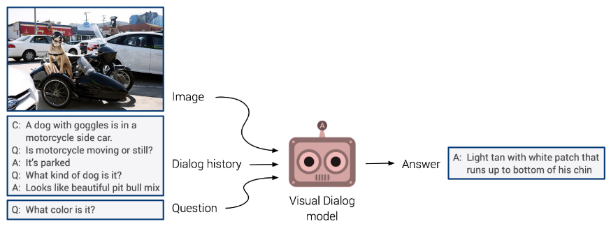

Reproducibility
-----------------

Two of the main experiments conducted by the authors were: 1) image retrieval from visual and text input and 2) text retrieval from visual and text input. Below we explain our replication efforts for both experiments.

### Experiment 1: Image retrieval from visual and text input

The authors assessed the performance of FROMAGe in retrieving the appropriate image conditioned on a sequence of interleaved image-text inputs from the Visual Storytelling (VIST) dataset [[?]](#vist). One example of a story sample from the dataset is shown bellow. 

The goal of this experiment was to observe the performance of FROMAGe in image retrieval when more context was provided as input. The first setting provided only the last sentence of dialog, the second setting provided all but only the sentences of the dialog and the third setting provided the whole dialog (sentences and images except the last image of course).

From those different settings, it was observed that the performance in image retrieval increased when more context was given as input. A lot of manual annotation was necessary for the evaluation of this experiment, which was infeasible in the context of this project.

To work around this problem, the only possible solution was to make our own manual annotations on 100 random samples. Based on our judgment, we would annotate if the retrieved image was good or not. To be able to evaluate our annotations we used accuracy as metric, which would allow us to observe the trend of the performance when more context was provided as input. Our results are shown the table bellow.

| Input                | Accuracy |
| -------------------- | -------- |
| 1 caption, 0 images  |   75%    |
| 5 captions, 0 images |   36%    |
| 5 captions, 4 images |   35%    |

From our replication efforts, we observe a decreasing trend of performance instead of increasing. It looks like providing more text or visual context has negative impact on the performance because it is more difficult to retrieve an image that fits a more detailed description. 

We are not sure if this contradiction to the authors results happens because of annotating fewer samples or because the way we annotated the samples was different from the instructions given to the real annotators (which were not disclosed).

### Experiment 2: Text retrieval from visual and text input

The authors evaluated FROMAGe on zero-shot Visual Dialog (VisDial) [[?]](#vdial). They tested its ability to select the
correct text answer (from 100 candidates) for a question
given an image and a conversation about it. One example of a story sample from the dataset is shown bellow.

The authors mention that they computed the perplexity of each question and answer sequence to measure performance, but they do not give enough details on how the needed probabilities were obtained. 

Since we could not exactly replicate the perplexity scores, there was no point in making any guesses because the numbers would not be comparable. Therefore, the replication of this experiment was skipped. 

 [?] Huang, T.-H., Ferraro, F., Mostafazadeh, N., Misra, I.,
Agrawal, A., Devlin, J., Girshick, R., He, X., Kohli, P.,
Batra, D., et al. Visual storytelling. In NAACL-HLT,
2016.

 [?] Das, A., Kottur, S., Gupta, K., Singh, A., Yadav, D., Moura,
J. M., Parikh, D., and Batra, D. Visual dialog. In CVPR,
2017.