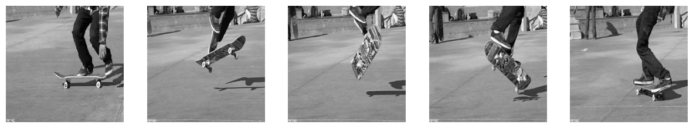

### Video Captioning

FROMAGe was trained with the goals of image captioning and image retrieval based on text. It was also shown by the authors that the model is able to work with a combination of visual and text input and hold a dialog. Every time, though, the model concidered images to be independent from each other. This is why we wanted to test the model's ability to receive a sequence of images and caption them as a single video. For this purpose, we used the TGIF dataset [[?]](#tgif) and more specifically this [file](https://github.com/raingo/TGIF-Release/blob/master/data/tgif-v1.0.tsv) as evaluation dataset. 

GIFs usually have duration of a few seconds. This means that they contain far less frames to choose from than longer videos. Frame selection is a difficult task on its own, since we want the frames to be different from each other and representative of the original sequence as well. For these reasons, we chose to work with GIFs instead of videos for captioning.

To simplify the frame selection procedure we sampled frames uniformly. In addition, to experiment with different amounts of visual context, we run the evaluation for two settings: 5 frames per GIF and 10 frames per GIF. We used Cosine Similarity as evaluation metric to compare the contextual similarity of the model's captions and the original ones. Exactly 5,000 GIFs of the dataset were evaluated for each setting. The prompt template used was to add "Give caption as video." after the list of selected frames. The results are shown in the table bellow.

| Frames per GIF | Average Cosine Similarity |
| -------------- | ------------------------- |
| 5              | 0.307 ± 0.186             |
| 10             | 0.288 ± 0.174             |

We see that the model's captions are not very close to the meaning of the original captions. Furthermore, we see a small yet insignificant decline of the metric when providing more frames as input. In fact, uppon closer inspection, we see that the model's captions are getting worse with 10 frames as input. An example is shown bellow. 

  
Original caption: a skate boarder is doing trick on his skate board.

  
Caption with 5 frames: skateboarder in the skateboarder jumps over a rail and lands on.

  
Caption with 10 frames: a skateboarder skateboarder in the skateboarder in the art.

When more visual context is provided, the model seems to ignore the "Give caption as video." instruction and focuses on the main object across the images. As a result, the model fails to produce a good video caption.

 [?] Li, Yuncheng, et al. "TGIF: A new dataset and benchmark on animated GIF description." Proceedings of the IEEE Conference on Computer Vision and Pattern Recognition. 2016.